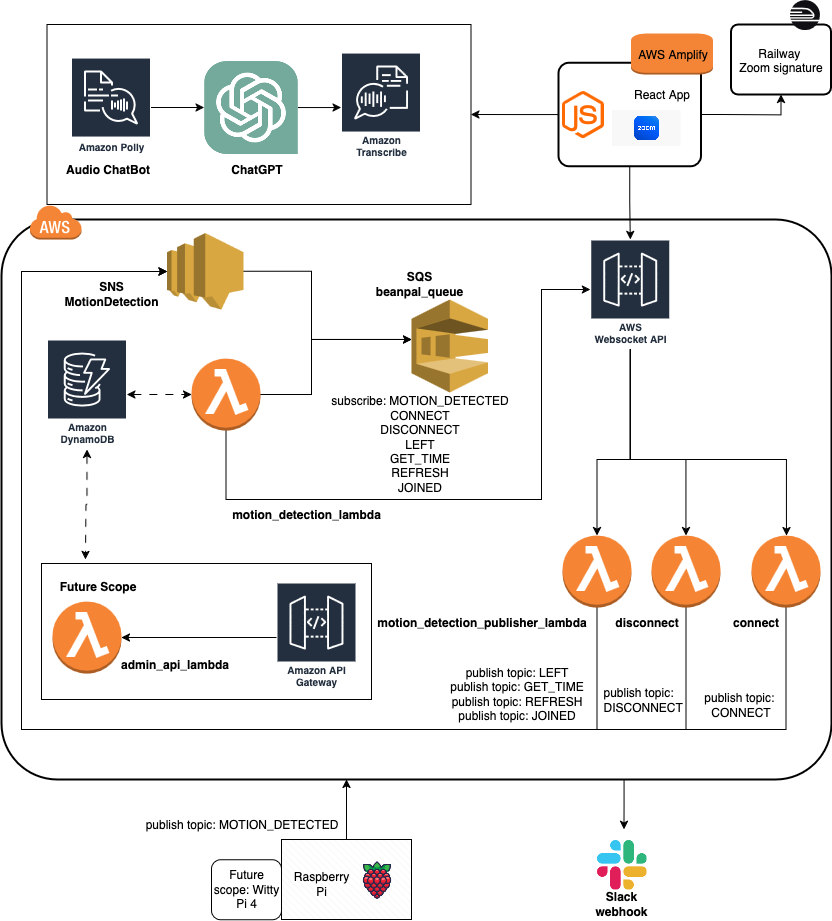

# ☕ Project Title: *Don’t Drink Coffee Alone*

### A Smart, Spontaneous Coffee Break Companion — for Two or for One

## 📄 Description

**Don’t Drink Coffee Alone** is a socially-driven IoT application designed to enhance connection and well-being in remote or hybrid environments. Whether it’s two coworkers catching up or one person enjoying a solo moment, this system turns everyday coffee breaks into either a live human interaction or a meaningful conversation with an AI-powered audio companion.

When someone approaches the coffee station — detected by a motion sensor on a **Raspberry Pi** — the system checks whether the paired partner is available. If they are, it starts a spontaneous **Zoom** video chat. If not, an **AI chatbot** powered by **ChatGPT**, **AWS Polly**, and **AWS Transcribe** takes over and converses with the user through speech, offering a unique solo experience.

## 🧠 Key Functional Modes

* ☕ **Paired Mode**: Two users are connected via **Zoom** for real-time spontaneous coffee chats.
* 🤖 **Solo Mode**: If the paired user is unavailable, the system offers an **audio-based chatbot experience**, simulating conversation using speech-to-text and text-to-speech.
* 📢 **Slack notifications** and 💬 **AI summaries** enhance team visibility and user reflection.

## 🏗️ Architecture & Technology Stack

### 🔹 **Edge Layer – Raspberry Pi**

* **Motion Sensor (PIR)**: Detects user presence at the coffee station.
* **Camera**: Activates video stream (used for Zoom calls).
* **Microphone + Speaker**: For AI audio interaction during Solo Mode.
* Communicates with AWS via **API Gateway**.

### ☁️ **Cloud Components (AWS + AI Services)**

#### 📡 **Amazon API Gateway**

* Entry point for all device-initiated events
* Routes requests to appropriate Lambda handlers

#### 🧠 **AWS Lambda**

* Central logic handler for:

  * Determining whether the paired user is available
  * Triggering Zoom sessions (Paired Mode)
  * Launching the AI chatbot pipeline (Solo Mode)
  * Logging events and sending alerts via SNS or Slack

#### 📬 **AWS SNS** + **AWS SQS**

* **SNS**: Sends notifications to user devices or app when a coffee break is initiated
* **SQS**: Buffers background jobs (e.g. transcription storage, Slack message delivery)

#### 🗄️ **AWS DynamoDB**

* Stores:

  * User pairing & availability status
  * Interaction history
  * AI summaries
  * Event logs (motion, start/stop sessions)

### 👥 **Paired Mode: Real-Time Human Interaction**

* **Zoom SDK Integration**:

  * Initiates real-time video calls inside the ReactJS web app
  * Embedded session for spontaneous chat when both users are available

### 🤖 **Solo Mode: AI Companion Experience**

#### 🎙️ **AWS Transcribe**

* Converts live speech from the user into text in real time

#### 🧠 **ChatGPT (OpenAI API or hosted model)**

* Responds to user input conversationally, providing friendly responses, emotional support, or casual conversation
* Generates text output, which is sent to Polly

#### 🗣️ **AWS Polly**

* Converts ChatGPT’s responses into natural-sounding speech
* Outputs audio via speaker on the Raspberry Pi, enabling a continuous two-way audio conversation

### 🖥️ **Frontend – ReactJS App**

* Web dashboard for:

  * User pairing and session management
  * Status updates (who’s available)
  * Reviewing conversation summaries
  * Adjusting AI chatbot tone and preferences
  * Integrating Zoom session inside browser

### 🔔 **Slack Webhook Integration**

* Sends intelligent notifications to team channels:

  * A just had a solo coffee chat with the AI bot.”
  * A and B chatted for 8 minutes — Keywords: deadlines, burnout, ideas”
* Useful for remote team bonding and lightweight wellness tracking

## 🔐 Security & Privacy

* End-to-end encryption for Zoom calls
* AI chats and transcripts are opt-in and can be ephemeral

## 🧪 Possible Extensions

* Sentiment analysis for emotional state monitoring
* Calendar-based availability integration (Google Calendar, Slack status)
* Smart reminders or insights (e.g., “You haven’t had a coffee chat in 3 days”)

